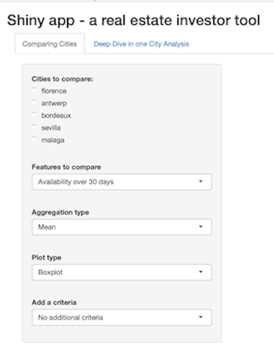
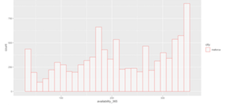
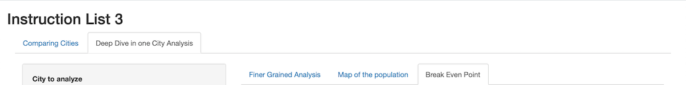

```{r setup, include=FALSE}
knitr::opts_chunk$set(echo = FALSE, fig.align="center")

# install.packages('leaflet')
library(dplyr)
# issue with this one
library(stringr)
library(ggplot2)
library(data.table)
library(repr)
library(leaflet)

# Reading cleansed data
cities <- c("malaga","sevilla")
data_dates <- c("2020-06-30","2020-06-29")

# We are only interested in data between min_date and max_date
min_date <- '2020-05-01'
max_date <- '2020-11-01'

files_paths <- c()

for(city in cities){
    file_dir <- file.path("../APP/", "data_cleansed", city)
    file_subdirs <- list.dirs(file_dir)
    file_subdirs <- file_subdirs[-1]

    for(file_subdir in file_subdirs){
        if(file_subdir < file.path(file_dir, min_date) | file_subdir > file.path(file_dir, max_date)  )
            file_subdirs = file_subdirs[file_subdirs != file_subdir]
    }
    files_paths <- c(files_paths, file_subdirs)
}
files_paths <- file.path(files_paths, "listings.csv")
listings <-
    do.call(rbind,
            lapply(files_paths, read.csv, row.names=1))

# PREPROCESSING #
# BreakEvenPoint
cities_spain <- c("sevilla","malaga")
square_meter <- c(2516.67,2842.86)
charges <- c(126.44,112.01)

for(i in 1:length(cities_spain)){
    city <- cities_spain[i]
    bool_index <- listings$city==city
    # Creating fixed costs column
    fixed_cost<-(square_meter[i]*(listings[bool_index,]$bedrooms* 10 + (1.5*listings[bool_index,]$bedrooms+8.5)))
    listings[bool_index, 'fixed_cost'] <- fixed_cost
    # Creating var costs column
    listings[bool_index, 'var_cost'] <- ((charges[i]/31) * (365-as.integer(listings[bool_index, ]$availability_365)))
    # Break Even Point in Year
    listings[bool_index,'bep_year'] <- listings[bool_index,]$fixed_cost/(listings[bool_index,]$revenue_365-listings[bool_index,]$var_cost)
    # Break Even Point in Turnover
    listings[bool_index,'bep_turnover'] <- listings[bool_index,]$fixed_cost/((listings[bool_index,]$revenue_365-listings[bool_index,]$var_cost)/listings[bool_index,]$revenue_365)
}
# Preparing the rooms
listings$bedrooms <- ifelse(listings$bedrooms == 0, NaN, listings$bedrooms)
listings$bedrooms <- ifelse(listings$bedrooms >= 5, "5+", listings$bedrooms)
```


### Shiny App - Pitch 

Let us present a little app that gathers the various aspects of Data Analysis with R we've tackle during the Data analytics course.

- Data loading
- Data cleaning
- Features selection
- Features analysis with graphics

__Context__ : "A real estate investor is looking forward to using this data in order to take a decision regarding the best option he has in real estate to generate profit on Airbnb from his investment."

__Data__ : Airbnb Records from http://insideairbnb.com

__tools__ : [dplyr](https://dplyr.tidyverse.org), [ggplot2](https://ggplot2.tidyverse.org/reference/ggplot.html), [leaflet](https://leafletjs.com), [shiny](https://shiny.rstudio.com), [slidy2](https://www.w3.org/Talks/Tools/Slidy2/#(1))

                          Pierre-Mathieu Barras - Marius Sorrin - Camille Marini


### Overview - Subject 

- We have to take care to select the best possible features and graphics to make effective decision making : **availability, price and revenue**

- As real estate investors, we selected some indicators to be able to compare the cities with each other (and their neigborhoods)

- For the sake of simplicity we have only selected Western European cities for the moment.


            sample_cities <- c('Mallorca','Antwerp','Sevilla','Napoli')
            


### Preprocessing  : getting data and prepare it

A part of the script were given but we added some functions


### App architecture - server and ui

- The UI part organizes the general layout, bind the inputs (**city, features to compare, graphics and metrics selection**) and render the outputs (**plots, specific values**)

- The server part **catches the UI inputs** to do the computations and **sends the results back to the UI as outputs**. Other underlying functions could be implemented (Zoom function for exemple)

- We split the analysis of our application in two parts:
    - A quick analysis to differentiate between cities (*which city to invest in ?*)
    - A more detailed analysis of a specific city (*what kind of investment in that city ?*) 

### Graphical analysis - quick view and global comparaisons

A quick analysis to differentiate between cities (*which city to invest in ?*)

  - select one or more city 
  - select the indicator (availability, price, revenue)
  - selec an aggregation type
  - overlay one other critera

`


### Graphical analysis - quick view and global comparaisons

- The investor can use 3 differents graphics : **Boxplot, Histogram and density function**


- To easy the comparaison, it's possible to **overlay the graphics of dfferent cities** an even **add dimensions**


- when there are too many features, the graphics quickly become unreadable, so it is possible to **zoom in and out**


### Graphical analysis - deep dive into a specific city
A more detailed analysis of a specific city (*what kind of investment in that city ?*) 



First you can compare any metric over 10 neigborhoods, the room types and the numbers of bedrooms at the same time.


You can also plot a map to better understand the distribution within cities
```{r, echo=FALSE, warning=FALSE, message=FALSE}
defaultW <- getOption("warn")
options(warn = -1)
listings_small <- listings[c(1:1000), ]
listings_small %>%
  leaflet() %>%
  addTiles() %>%
  addMarkers(popup = as.character(listings_small$revenue_365),clusterOptions = markerClusterOptions())
options(warn = defaultW)
```


### Bonus - Break Even Point analysis, Zoom function
- The period in years when the investement starts to generates benefits for the investor.
- Approach based on fixed costs and variable costs.
- Estimation of more profitable cities.

```{r, message=FALSE}
defaultW <- getOption("warn")
options(warn = -1)
listings$bep_year[listings$bep_year>100] <- 100
distrib_bep_year <- ggplot(listings, aes(city, bep_year))
distrib_bep_year + geom_boxplot(aes(colour = "red"), outlier.shape = NA) +
    scale_y_continuous(limits = quantile(listings$bep_year, c(0.1, 0.9), na.rm = T))
options(warn = defaultW)
```


### Conclusion 
- Our application is meant to help investors **compare cities and neigborhoods**
- Once the city is selected, the investor can make precision about the kind of asset to invest in and the neigborhood.
- It provides specific metrics **at glance**
- Currently the App is limited to **4** cities for memory purposes
- We would improve the app by adding more cities and select and process cities' data **on the fly**
- And improve data visualisation  with math functions : **availability predictions, revenue estimation...**
- We shared this app in a simplified version on https://karhyus.shinyapps.io/final_projet_sorrin_marini_barras/ and the whole project is available on https://github.com/Ducrioma/DataAnalysisApp
- **Now the demo**

```{r, message=FALSE}
defaultW <- getOption("warn")
options(warn = -1)
listings_malaga <- listings[city=='malaga', ]
listings_malaga$bep_year[listings_malaga$bep_year>100] <- 100
g <- ggplot(listings_malaga, aes(bep_year,revenue_365))
g + geom_smooth(method = lm) + labs(x="Break Even Point in Year", y='Revenue per Year')
options(warn = defaultW)
```
